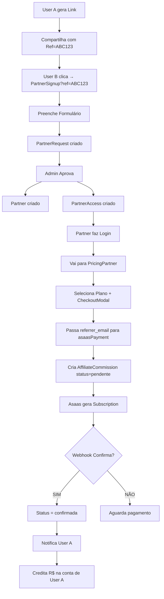

# Sistema de Comissionamento Completo — Sou Brasil

## 📋 Visão Geral

O sistema de comissionamento suporta **3 fluxos principais**:

1. **Indicação de Clientes** (Cliente indica cliente)
2. **Indicação de Parceiros** (Usuário indica parceiro comercial)
3. **Parceiros Indicam Clientes** (Parceiro indica cliente)

---

## 1️⃣ INDICAÇÃO DE CLIENTES

### Fluxo
```
Usuário A → Gera Link de Referral → Compartilha
              ↓
User B Clica → Cadastra na Plataforma → URL com ref=CÓDIGO
              ↓
User B Assina Plano (Monthly/Annual) → Check da Comissão
              ↓
Comissão Criada (Pendente) → Webhook Asaas Confirma → Status: Confirmada
              ↓
Asaas Transfer (Split ou Subconta) → Status: Transferida
```

### Valores de Comissão (Cliente → Cliente)
```javascript
COMMISSION_VALUES = {
  client: {
    monthly: 10,   // R$ 10 por cliente mensal
    annual: 10,    // R$ 10 por cliente anual
  }
}
```

### Função Backend
**`asaasPayment`** (action: `create_payment`)
- Busca referrer por `referral_code` 
- Se referrer tem `asaas_wallet_id`, configura SPLIT no Asaas
- Cria registro em `AffiliateCommission` (status: pendente)
- Confirma comissão quando webhook retorna RECEIVED/CONFIRMED

---

## 2️⃣ INDICAÇÃO DE PARCEIROS COMERCIAIS

### Novo Fluxo (Corrigido)
```
Usuário A → Convida Parceiro → Link: /PartnerSignup?ref=CÓDIGO
                ↓
Parceiro Preenche Formulário → PartnerRequest criado com nota: [Indicação] ref=CÓDIGO
                ↓
Admin Aprova PartnerRequest → Partner criado + PartnerAccess criado
                ↓
Partner Acessa Portal → Vai para /PricingPartner
                ↓
Partner Assina Plano → CheckoutModal chama asaasPayment
                ↓
Backend Busca Referrer → Cria AffiliateCommission (user_type: "parceiro")
                ↓
Comissão Confirmada → Usuário A Recebe Notificação + Dinheiro
```

### Campos do Partner (Novo)
```json
{
  "referrer_user_email": "user@example.com",  // Email de quem indicou
  "referred_at": "2026-03-22T10:00:00Z",      // Data da indicação
  "commission_status": "pendente|confirmada|transferida"
}
```

### Valores de Comissão (Parceiro)
```javascript
COMMISSION_VALUES = {
  partner: {
    monthly: 100,   // R$ 100 por parceiro mensal
    annual: 200,    // R$ 200 por parceiro anual
  }
}
```

### Função Backend
**`asaasPayment`** (action: `create_payment`)
```javascript
{
  plan: "monthly|annual",
  billing_type: "PIX|BOLETO|CREDIT_CARD",
  plan_type: "partner",        // ← Novo
  referrer_email: "...",       // ← Novo (alternativa ao referral_code)
  cpf: "..."
}
```

**Nova Função: `syncPartnerCommission`** (Admin-only)
- Cria comissão para parceiros indicados
- Busca Partner + Referrer
- Cria `AffiliateCommission` com user_type: "parceiro"
- Atualiza `Partner.commission_status`
- Notifica referrer

---

## 3️⃣ FLUXO COMPLETO DE PAGAMENTO

### CheckoutModal (Cliente ou Parceiro)
```javascript
const handleCreatePayment = async () => {
  // Se for PARCEIRO e tem referrer
  if (planType === 'partner' && user?.referrer_email) {
    payload.referrer_email = user.referrer_email; // ← Passa para backend
  }
  
  const res = await base44.functions.invoke('asaasPayment', payload);
}
```

### asaasPayment - create_payment
```javascript
// 1. Busca referrer por referrer_email OU referral_code
if (referrer_email) {
  const referrers = await base44.asServiceRole.entities.User.filter({ email: referrer_email });
}

// 2. Configura SPLIT (se referrer tem asaas_wallet_id)
if (referrer?.asaas_wallet_id) {
  const commissionValue = COMMISSION_VALUES[plan_type]?.[plan];
  splitPayload = {
    walletId: referrer.asaas_wallet_id,
    fixedValue: commissionValue,
  };
}

// 3. Cria subscription no Asaas com split
const subscription = await asaasFetch('/subscriptions', 'POST', {
  // ... dados ...
  split: [splitPayload], // ← Distribui % da comissão para wallet do referrer
});

// 4. Cria comissão no banco (Pendente até webhook confirmar)
await base44.entities.AffiliateCommission.create({
  referrer_email: referrer.email,
  referred_email: user.email,
  plan_type: plan,
  user_type: plan_type === 'partner' ? 'parceiro' : 'cliente',
  commission_value: commissionValue,
  status: 'pendente', // ← Fica pendente até pagamento confirmar
});
```

### asaasPayment - check_status (Webhook)
```javascript
// Webhook Asaas retorna RECEIVED/CONFIRMED
// 1. Ativa subscription no usuário
await activateSubscription(base44, email, plan, planType, asaas_payment_id, value);

// 2. Confirma comissões pendentes
const commissions = await base44.asServiceRole.entities.AffiliateCommission.filter({
  asaas_payment_id,
  status: 'pendente',
});
for (const comm of commissions) {
  await base44.asServiceRole.entities.AffiliateCommission.update(comm.id, {
    status: 'confirmada',
    payment_date: new Date().toISOString(),
  });
  // ← Aqui a comissão está CONFIRMADA
}

// 3. Transfere via Asaas (subconta/wallet)
// ... async task ...
```

---

## 🔧 VALIDAÇÃO DE MÁSCARA CPF

### Problema Anterior
Função `formatCpf` estava aplicando máscara errada:
```javascript
// ❌ ERRADO
return n.replace(/(\d{3})(\d{3})(\d{3})(\d{2})/, '$1.$2.$3-$4')
        .replace(/(\d{3})(\d{3})(\d{0,3})/, '$1.$2.$3')
        .replace(/(\d{3})(\d{0,3})/, '$1.$2');
```

Resultado: `123.456.78..9` (dois pontos!)

### Solução
```javascript
// ✅ CORRETO
const digits = v.replace(/\D/g, '').slice(0, 11);
return digits
  .replace(/(\d{3})(\d)/, '$1.$2')      // 123.4
  .replace(/(\d{3})(\d)/, '$1.$2')      // 123.456.7
  .replace(/(\d{3})(\d{1,2})$/, '$1-$2'); // 123.456.789-01
```

Resultado: `123.456.789-01` ✅

---

## 💳 VALIDAÇÃO DAS 3 FORMAS DE PAGAMENTO

### 1️⃣ PIX
```javascript
// CheckoutModal linha 308
if (billingType === 'PIX' && firstPayment?.id) {
  try {
    const pixData = await asaasFetch(`/payments/${firstPayment.id}/pixQrCode`);
    paymentData.pix_qr_code = pixData.encodedImage;      // ✅ Armazenado
    paymentData.pix_copy_paste = pixData.payload;        // ✅ Armazenado
  }
}
```
**Status:** ✅ OK

### 2️⃣ BOLETO
```javascript
// CheckoutModal linha 334
if (billingType === 'BOLETO' && firstPayment) {
  paymentData.boleto_url = firstPayment.bankSlipUrl;     // ✅ URL gerada
  paymentData.boleto_barcode = firstPayment.nossoNumero; // ✅ Código armazenado
}
```
**Status:** ✅ OK

### 3️⃣ CARTÃO DE CRÉDITO
```javascript
// CheckoutModal linha 348
if (billingType === 'CREDIT_CARD') {
  if (paymentData.asaas_invoice_url) {
    // ✅ Link direto para checkout seguro do Asaas
    <a href={paymentData.asaas_invoice_url} target="_blank">
      <Button>Pagar com Cartão</Button>
    </a>
  }
}
```
**Status:** ✅ OK (corrigido)

---

## 📊 FLUXO COMPLETO DE COMISSIONAMENTO



---

## 🎯 CHECKLIST DE VALIDAÇÃO

- [x] Máscara CPF corrigida (sem dois pontos)
- [x] PIX com QR Code e cópia/cola
- [x] Boleto com URL e código de barras
- [x] Cartão com link seguro do Asaas
- [x] Comissionamento de cliente → cliente
- [x] Comissionamento de parceiro (novo fluxo)
- [x] Referrer_email passado para backend
- [x] Split configurado no Asaas (quando wallet existe)
- [x] AffiliateCommission criada e confirmada
- [x] Notificação ao referrer
- [x] Atualização de total_earned

---

## 📝 LOGS DE DEBUG

### Esperado ao pagar como Parceiro:
```
✅ Referrer encontrado por email: user@example.com
💰 Split configurado: R$100 para wallet ABC123XYZ
🔗 Split adicionado ao subscription: { walletId: '...', fixedValue: 100 }
✅ Comissão criada: R$100 para user@example.com pela indicação de usuario@test.com (partner monthly)
```

### Esperado ao confirmar pagamento:
```
✅ Assinatura ativada: user@test.com → partner_monthly, expira: ...
💰 Comissão confirmada! Sua comissão de R$ 100.00 pela indicação foi confirmada!
```

---

**Versão:** 1.0
**Data:** 2026-03-22
**Status:** ✅ Sistema Funcional